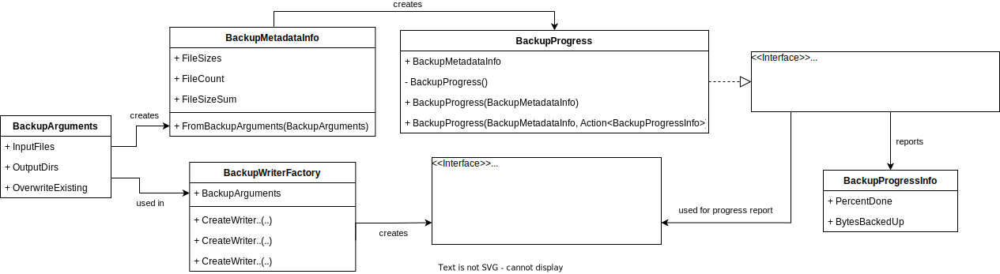

# SimpleFileBackup
Simple C# program for copying multiple files to multiple locations at once

## Download
https://github.com/malthee/SimpleFileBackup/releases

# SimpleFileBackup.Windows
## General
Select files or folders by pressing the Select buttons on the right. You can select multiple files or folders at once. After pressing OK the file locations will be saved in the drop down list. You can also add files by typing the path in the textbox and pressing enter. If you made a wrong selection, you can delete single items by selecting them in the drop down list and pressing "Delete Item". You can clear the list by pressing "Clear List".

Backup Destinations can be selected through the same process. Every file or folder in "Files to Backup" will be backed up to every "Backup Destination". 

## Settings

### Override idenetical files in directory
If you want to replace your old files with the new files enable the "Override identical files in directory" option. This way, if a file called 123.jpg is already in the directory, it will be replaced. Same goes for ZIP files.

### Put files in given directory
Copies the files into the selected directories.

### Create a subfolder in directory
Creates a subfolder in every given directory.

### Create a .zip file in directory
Create a .zip from the given files and copy it to every listed directory.

### Name Folder/.zip
Only works when "Create a subfolder in directory" or "Create a .zip file in directory" is selected.
You can name your folder or .zip file with a maximum of 20 characters. The characters have to be compatible with the windows filesystem.

### Add date to Folder/.zip name
Adds your local date to the folder/.zip name in the format name_10-10-2010.

### Save Defaults
Saves your file/backup locations and settings to keep them for the next program start. 

### Save Custom File Paths & Save Custom Backup Paths
Saves your file/backup locations in a text file you can choose the location of.

### Open File Paths & Open Backup Paths
You can open a text file that contains paths to files or directories. These paths will be inserted into the drop down list.

## Common problems
1. If you have windows security folder protection enabled, you might get errors like "File cannot be found" or "Permissions error". You can fix this by navigating to the protection history and pressing allow on the blocked entries.

| Navigate to protection history | Press actions -> allow |
|--|--|
|  |  |

# SimpleFileBackup.Core
Core is a `.NET Framework 2.0` library for persisting one or more files or folders in one or more other locations in any recoverable format. As an example it can be used to copy files and folders from different drive locations to multiple backup drives at once.  

An overview of the components can be seen in the following diagram:

## Public interface
* `BackupWriterFactory`: provides implementations of `IBackupWriter` 
* `IBackupWriter`: contract every backup writer has to implement. Used to start a backup with or without cancellation and progress reporting.
* `BackupArguments`: used to create a `BackupWriterFactory`. Contains input and output information.
* `BackupMetadataInfo`: can be created with `BackupArguments`. Contains information about file size and count which is handled.
* `IBackupProgress` and `BackupProgress`: extended Interface with `BackupMetadataInfo` for progress calculation and adapter implementation of `Progress<T>`.
* `BackupProgressInfo`: provides the user with information how far the backup is in percent and how many bytes have been written to output locations.

## Contribute
Feature requests and bugs must have a ticket and description before any pull request is accepted. There is also a Project board on GitHub in which some current feature requests are prioritized and documented.   
Otherwise any contributers are welcome!
